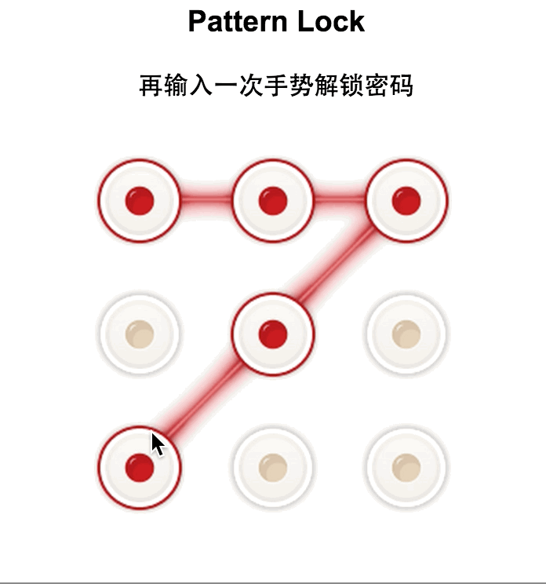

#手势解锁

原始模式，两次验证

---
##API
###lock.init(parent id, callback,langType);
初始化

parent id: 绑定DOM元素    
    
callback:初始化成功回调函数 
 
langType:提示信息语言设置（默认中文），可设置“cn”或“en”

### lock.setPattern(succCallback,failCallback);
**设置密码模式**

succCallback：成功回调函数，参数返回用户设置的密码

failCallback：失败回调函数

### lock.setPattern(lockPattern,succCallback,failCallback);
**解锁模式**

lockPattern:  解锁密码

succCallback：成功回调函数

failCallback：失败回调函数

用户利用手势输入密码，系统判断是否用户输入与解锁密码传入参数一致，如果一致则解锁成功，调用成功回调函数，否则调用失败回调函数

